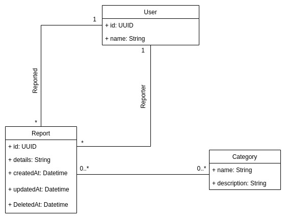

# Reporting System API

Reporting System API is a RESTful application. It permits the users to report other users for disrespecting the ethics and the legal agreements of use.

## Description

This application was created using Swift programming language and Vapor 4 framework.
The goal of the application is to let users to issue a report on other users who violate the rules of application use.
A user can generate a report using a specific endpoint, giving the reporter ID, the reported ID, a description of the rules violation and the categories of report such as sexism, scam, racism...

## About Vapor Framework

Vapor is an open source web framework written in Swift. It can be used to create RESTful APIs, web apps, and real-time applications using WebSockets. In addition to the core framework, Vapor provides an ORM, a templating language, and packages to facilitate user authentication and authorization.

## UML Class Diagram

## Application Install

- Download and install Swift and Vapor 4 framework
- Clone this repository
- Create a Postgresql database for the app
- Open a new terminal in the app directory and fire up "swift run" command
- The migrations will run automatically

## Documentation

All the endpoints are very well documented. Check the [docs folder](docs) for more details...
